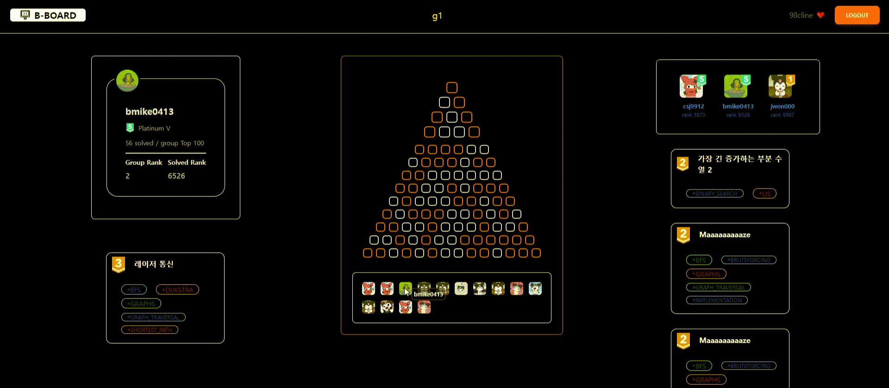
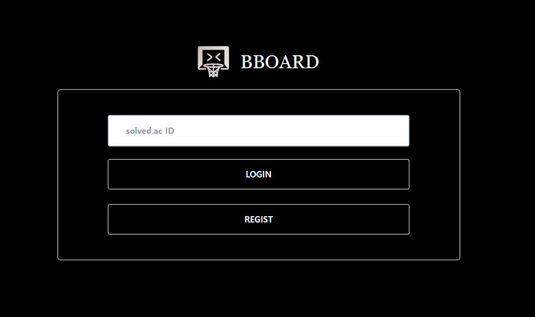
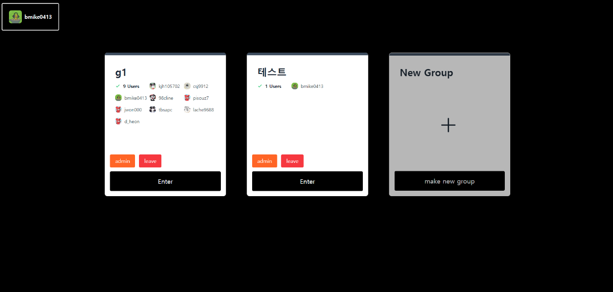
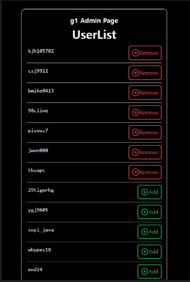
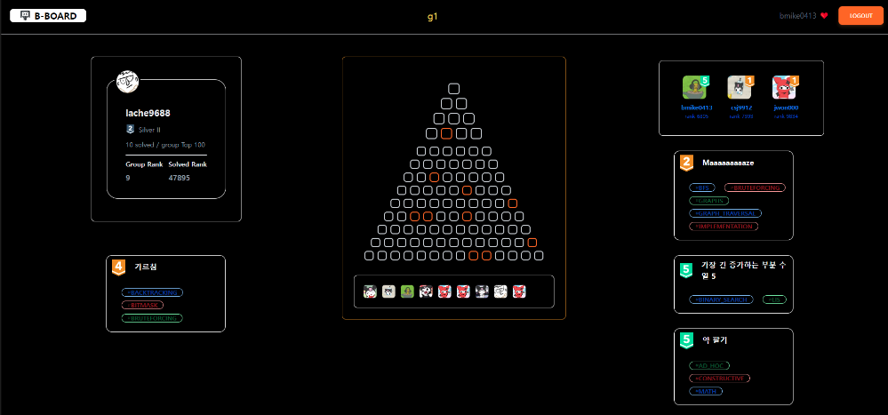
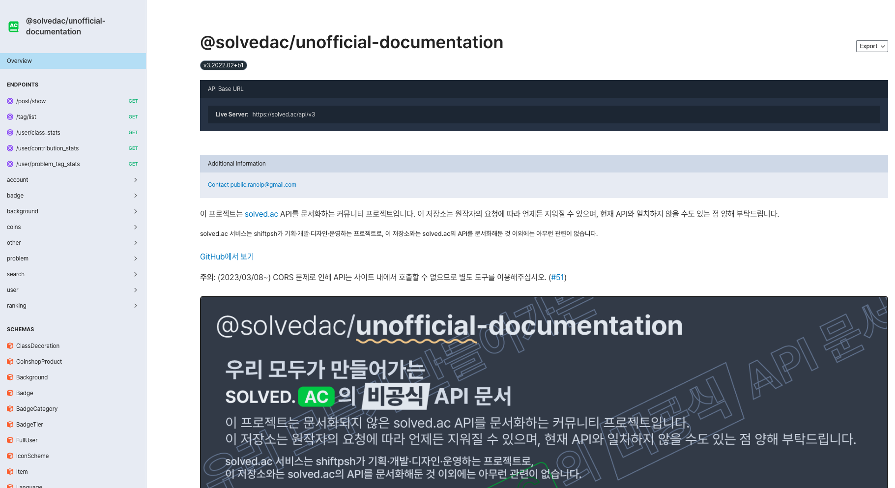

## BBOARD

###### SolvedAC api를 활용한 알고리즘 그룹 DashBoard 제공 및 문제 추천 서비스



<hr>

#### 목차 (with link)

1. [프로젝트 개요](#프로젝트-개요)
2. [프로젝트 세부 소개](#프로젝트-세부-소개)
3. [프로젝트 개발 명세](#프로젝트-개발-명세)
4. [소감](#소감)

<hr>

### 프로젝트 개요

##### BBoard

- 서비스 설명 : 사용자가 그룹을 생성하여 그룹원들이 푼 백준 문제들을 통합하여 시각화하고 사용자 레벨에 맞는 문제를 추천해주는 서비스
- 기획 배경 : 알고리즘을 공부하는 과정에서 서로가 문제를 추천하거나, 각자 풀이한 문제를 비교하면서 동기부여를 얻는 경우가 다수 있음. 따라서 사용자가 그룹을 생성하여 서로 풀어본 문제들을 한눈에 보고 비교할 수 있고, 유사한 티어의 문제를 자동으로 추천해주는 웹페이지를 만들고자함.
- 개발 기간 : 2023.11.13 ~ 2023.11.24 (2주)
  <br>

##### 🧑‍💻 팀소개

| 이담비                                                                                    | 정덕주                                                                                    |
| ----------------------------------------------------------------------------------------- | ----------------------------------------------------------------------------------------- |
|  |  |
| SSAFY 10기 8반                                                                            | SSAFY 10기 8반                                                                            |
| Front 70% Back 30%                                                                        | Back 70% Front 30%                                                                        |

<br>

##### 🛠️ 기술 스택

###### Front

  

###### Back

   

###### Environment

   

 

###### 버전 요구 사항

```
SpringBoot 3.1.5 Gradle
Vue3
solvec.ac api v3
```

<hr>

### 프로젝트 세부 소개

##### 🖥️ 화면 구성

| 화면       | 이미지                               |
| ---------- | ------------------------------------ |
| login page |  |
| group page |  |
| admin page |  |
| main page  |  |

<br>

##### 🎚️ 주요 기능

###### user/group

1. 백준 id 입력하여 로그인, 해당 아이디가 존재하지 않을 시 재입력하도록 알람
2. 아이디당 3개의 그룹에 소속 가능, 그룹에 속한 유저 정보 표시
3. 속한 그룹이 2개 이하일 때 신규 그룹 생성 기능
4. 그룹별 비밀번호 입력하여 admin page에서 유저 추가/방출 기능

###### mainpage

1. 유저 클릭 시 유저 아이디, 레벨, 레이팅 등의 정보 표시
2. 그룹에 속한 유저들이 푼 상위 100문제에서 클릭한 유저가 푼 문제 동적으로 표시
3. 마우스를 hover한 문제들에 대한 링크, 레벨, 연관 알고리즘 정보 제공
4. 상위 100문제 중에서 로그인한 유저 레벨과 유사한 문제 3개 자동 추천
5. 랭크 상위 3위까지 유저 정보 표시
   <br>

###### ⚠️ 참고사항 ⚠️

- solved.ac api가 비공식 api임으로 이후 version이 변경되거나 서비스를 중단할 수 있음
- solved.ac api 호출 횟수 제한으로 인해 오류가 발생할 수 있음.

<hr>

### 프로젝트 개발 명세

##### 🌲 Project Tree

```
BaekJoon-Group-Board
├─ springboot back
│  └─ bboard
│     └─ src
│        ├─ main
│        │  ├─ java
│        │  │  └─ com
│        │  │     └─ ssafypjt
│        │  │        └─ bboard
│        │  │           ├─ BboardApplication.java
│        │  │           ├─ config
│        │  │           │  ├─ SwaggerConfig.java
│        │  │           │  └─ WebConfig.java
│        │  │           ├─ controller
│        │  │           │  ├─ MainController.java
│        │  │           │  ├─ ProblemController.java
│        │  │           │  └─ UserGroupController.java
│        │  │           ├─ model
│        │  │           │  ├─ domain
│        │  │           │  │  ├─ groupinfo
│        │  │           │  │  │  ├─ GroupDomain.java
│        │  │           │  │  │  └─ UserAndGroupObjectDomain.java
│        │  │           │  │  ├─ ReloadDomain.java
│        │  │           │  │  ├─ solvedacAPI
│        │  │           │  │  │  ├─ FetchDomain.java
│        │  │           │  │  │  ├─ ProblemAndAlgoObjectDomain.java
│        │  │           │  │  │  ├─ ProblemDomain.java
│        │  │           │  │  │  ├─ UserDomain.java
│        │  │           │  │  │  ├─ UserPageNoObjectDomain.java
│        │  │           │  │  │  ├─ UserTierDomain.java
│        │  │           │  │  │  └─ UserTierProblemDomain.java
│        │  │           │  │  └─ UserAddReloadDomain.java
│        │  │           │  ├─ dto
│        │  │           │  │  ├─ Group.java
│        │  │           │  │  ├─ Problem.java
│        │  │           │  │  ├─ ProblemAlgorithm.java
│        │  │           │  │  ├─ RecomProblem.java
│        │  │           │  │  ├─ User.java
│        │  │           │  │  └─ UserTier.java
│        │  │           │  ├─ enums
│        │  │           │  │  └─ SACApiEnum.java
│        │  │           │  ├─ repository
│        │  │           │  │  ├─ GroupRepository.java
│        │  │           │  │  ├─ ProblemAlgorithmRepository.java
│        │  │           │  │  ├─ ProblemRepository.java
│        │  │           │  │  ├─ RecomProblemRepository.java
│        │  │           │  │  ├─ TierProblemRepository.java
│        │  │           │  │  ├─ UserGroupRepository.java
│        │  │           │  │  ├─ UserRepository.java
│        │  │           │  │  └─ UserTierProblemRepository.java
│        │  │           │  └─ service
│        │  │           │     ├─ GroupService.java
│        │  │           │     ├─ GroupServiceImpl.java
│        │  │           │     ├─ ProblemService.java
│        │  │           │     ├─ ProblemServiceImpl.java
│        │  │           │     ├─ UserService.java
│        │  │           │     └─ UserServiceImpl.java
│        │  │           ├─ session
│        │  │           │  ├─ SessionConst.java
│        │  │           │  └─ SessionManager.java
│        │  │           └─ util
│        │  │              └─ UtilConfig.java
│        │  └─ resources
│        └─ test
│
└─ vue front
   ├─ src
   │  ├─ App.vue
   │  ├─ assets
   │  │  ├─ logo.svg
   │  │  ├─ logoImg.png
   │  │  └─ main.css
   │  ├─ components
   │  │  ├─ groupselectpage
   │  │  │  ├─ EmptyGroupBox.vue
   │  │  │  └─ GroupBox.vue
   │  │  ├─ header
   │  │  │  └─ items
   │  │  ├─ items
   │  │  │  └─ problem-card
   │  │  │     ├─ AlgorithmTag.vue
   │  │  │     └─ ProblemCard.vue
   │  │  └─ mainpage
   │  │     ├─ header
   │  │     │  ├─ items
   │  │     │  │  ├─ GroupName.vue
   │  │     │  │  ├─ LoginUserInfo.vue
   │  │     │  │  └─ LogoTitle.vue
   │  │     │  └─ NavigationHeader.vue
   │  │     ├─ leftchange
   │  │     │  ├─ pyramid-and-usergrid
   │  │     │  │  ├─ GroupPyramid.vue
   │  │     │  │  ├─ GroupUserGrid.vue
   │  │     │  │  └─ usergrid
   │  │     │  │     ├─ MiniProfile.vue
   │  │     │  │     └─ UserTile.vue
   │  │     │  ├─ PyramidAndUsers.vue
   │  │     │  ├─ userprofile-and-hoverpro
   │  │     │  │  ├─ HoverPro.vue
   │  │     │  │  ├─ userprofile
   │  │     │  │  │  └─ UserDetailInfo.vue
   │  │     │  │  └─ UserProfile.vue
   │  │     │  └─ UserProfileAndHoverPro.vue
   │  │     ├─ LeftChangeBox.vue
   │  │     ├─ rightfixed
   │  │     │  ├─ GroupRating.vue
   │  │     │  ├─ ratingprofile
   │  │     │  │  └─ RatingProfile.vue
   │  │     │  └─ RecoPro.vue
   │  │     └─ RightFixedBox.vue
   │  ├─ main.js
   │  ├─ router
   │  │  └─ index.js
   │  ├─ stores
   │  │  ├─ adminInfo.js
   │  │  ├─ changebox-db.js
   │  │  ├─ fixedbox-db.js
   │  │  ├─ group.js
   │  │  ├─ loginInfo.js
   │  │  ├─ main-api.js
   │  │  └─ userInfo.js
   │  └─ views
   │     ├─ AdminPageView.vue
   │     ├─ AdminPasswordView.vue
   │     ├─ GroupSelectView.vue
   │     ├─ HomeView.vue
   │     ├─ LoginPageView.vue
   │     ├─ MainPageView.vue
   │     └─ NewGroupFormView.vue
   ├─ tailwind.config.js
   └─ vite.config.js

```

<br>

##### 💿 API 정보

###### solvec.ac 비공식 api v3

https://solvedac.github.io/unofficial-documentation/#/



###### 사용한 API

1. 사용자 정보 가져오기 (GET)

```
https://solved.ac/api/v3/user/show?handle=[유저아이디]
```

2. 상위 100문제 가져오기 (GET)

```
https://solved.ac/api/v3/user/top_100?handle=[유저아이디]
```

3. 사용자 티어별 푼 문제 수 가져오기 (GET)

```
https://solved.ac/api/v3/user/problem_stats?handle=[유저아이디]
```

4. 사용자가 푼 문제 페이지별로 가져오기 (GET)

```
https://solved.ac/api/v3/search/problem?query=@[유저아이디]&sort=level&direction=desc&page=[페이지번호]"
```

<hr>

### 상세 설명 및 소감

- 👋 [이담비]()
- 👋 [정덕주]()
